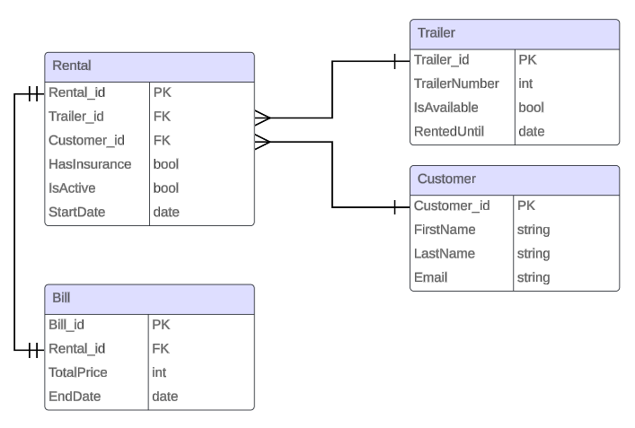

# SI_OLA3 + SI_OLA4
Youtube video - https://www.youtube.com/watch?v=_qzvakWuCdI

## Remote Event Storming Session
We had a remote event storming session following this [guide](https://ddd-practitioners.com/2023/03/20/remote-eventstorming-workshop/) and we documented our workshop and the different steps. 

To start with we explored the domain in an unstructured way and produced this:

Then we added sequence to the events and discussed our questions, which we added to illustrate like so:

Then we identified the pivotal events, which we believe are these:

We identified the actors and their commands:

And identified the policies and business invariants:

We decided that payment will not be in our scope and instead be handled through an external system: 

Then we identified the read models:

And found the aggregates and their bounded context:

### Creating C4 diagrams
After our event storming session, we started on creating some C4 diagrams.
Level 1 - Context diagram:

Level 2 - Container diagram:

Level 3 - Component diagram:

### Ubiqutous language
We recognized the following words as essiential to our case.\
**Trailer** - The trailers are owned by MyTrailer and are identified by a location id and a number.\
**Users / Customers** - The individuals who rent trailers. The two terms are used interchangeably.\
**Owner / MyTrailer** - The primary owner of the trailers and the MyTrailer booking system.\
**Locations** - A physical place where the trailers can be picked up by the users. The location is identified by a location id.\
**Specialist location** - A type of location where the customer can pick up specifically the trailers rented for a period beyond 24 hours.\
**Branding** - The iconography of the MyTrailer business and partner companies on the trailers.\
**Partner Companies / Partners** - Separate business that provide the locations for the trailers to be parked in exchange for branding on the trailers and pay MyTrailer for the rental service.\
**Mobile app** - An application for mobile devices, where the customer can make short term rentals of trailers.\
**Booking** - The act of reserving a trailer.\
**Short term rental** - A booking which is completed before 00:00 the day it was rented.\
**Long term rental** - A booking which is completed earliest the day after the booking of the trailer has occurred, only available through the website.\
**Website** - A site on the internet where the customer can make short- and long term rentals of trailers.\
**Excess rental fee** - A penalty fee applied to the price of renting a trailer when the maximum rental period is exceeded.\
**Rental insurance** - Insurance for a trailer covering any damages, caused by fair usage, that may occur during the rental period.\
**Fair usage** -  A legal contract which shows in detail what kind of damage will be covered by the rental insurance fee. All customers must sign that they read and understand the terms before renting a trailer.

# SI_OLA4
We have omitted some functionality to meet the deadline. This includes:

- a create/login system for both customers and partners.
- The use of locations is not added for customers or partners.
- Partners cannot add new trailers.

## Preparing for microservices
In this section we will provide a plan for splitting up the monolith project into microservices. The bounded context and C4 diagrams will be our primary guideline for dividing the project into smaller projects.

We currently have 2 projects in this repository. A frontend and a backend.

### Frontend
The frontend will be split into a website and a mobile application. We would use react and react-native to make both projects more streamlined with each other so a frontend developer could more easily work on both projects.

### Backend
For the backend we would split up the project into 3 seperate API's.

1. Handles the interactions from the customers through the website or mobile application.

2. Handles the interactions from the partners adding or updating their trailers on different locations. 

3. Handles the billing and sends the information to the 3rd party payment system. 

### Database
We would use a shared SQL database as data consistency is important and SQL provides us better tools to ensure data integrity compared to NoSQL. Having primary and foreign keys reduces the amount of redundancy currently over saturating our database. Joining tables would be easier and we can reduce the complexity needed for the 2 systems to integrate with each other.

When researching which approach is best we found the debate to focus around performance, complexity and scaleability. There is currently no reason to believe data volume is going to be a problem thus eliminating the performance/scaleability argument. Adding complexity for the sake of adding complexity is unnecessary as it solves a non existing problem. This makes the shared SQL DB the superior choice in our eyes.

We could always add seperate databases if the need arises.

### ER diagram

This image shows how we intend to design the SQL database when moving on with the project.

As locations and partners is not within the scope of the current project we have not included them in this diagram. A trailer would have a location and a partner foreign key. Location and partner would be entities that we consider value objects.